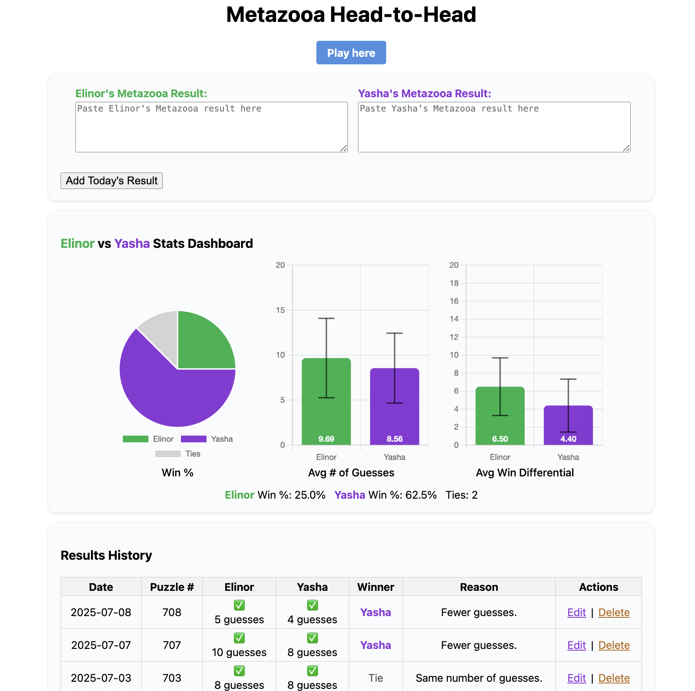

# Metazooa Head-to-Head: Elinor vs Yasha

A simple, modular web app for tracking your daily Metazooa results and friendly rivalry stats between Elinor and Yasha.

---



---

## Features

- **Paste daily Metazooa results** for both players (side-by-side input).
- **Winner auto-calculated:**  
  - If only one solves, that player wins  
  - If both solve, lower number of guesses wins  
  - If tied, it's a tie  
  - If both stumped, it's a tie  
- **Graphical stats dashboard:**  
  - Win % (pie chart)  
  - Average number of guesses (bar chart) with standard deviation
  - Average win differential (bar chart) - how much each player wins by on average
- **Full results history** table, including winner and reason for each day, sorted by puzzle number (newest first).
- **Edit and delete** any previous entry directly in the browser.
- **Export/Import CSV** to back up or restore all data, or to use with Google Sheets/Excel.
- **All data is private and stays in your browser** (using localStorage).
- **No server or sign-in required.**

---

## Project Structure

```
metazooa-stats/
├── metazooa-head2head.html # Main HTML file (entry point that loads all resources)
├── css/ # CSS styles folder
│ └── styles.css # All CSS styles
├── js/ # JavaScript modules
│ ├── config.js # Configuration constants (colors, chart settings)
│ ├── data-utils.js # Data handling utilities (functions for data processing, stats calculation, and storage)
│ ├── chart-utils.js # Chart creation and rendering
│ ├── ui-handlers.js # User interface event handlers
│ └── main.js # Core application logic and initialization
├── metazooa_elinor_yasha.csv # Sample/exported data
└── ui_screenshot.png # Screenshot for documentation
```

---

## How To Use

1. **Open `metazooa-head2head.html` in your web browser** (double-click, or right-click and open with Chrome/Firefox/Edge/Safari).
2. **Paste your Metazooa result** in the Elinor or Yasha box, and click **"Add Today's Result."**
3. **See stats and history** update automatically.
4. To **edit or delete** a past entry, use the links in the Results History table.
5. To **back up or share data**, use **Export CSV** to save your history, and **Import CSV** to restore it (or load it on another device/browser).
6. **Data persists automatically** as long as you use the same browser and don't clear site data.

> **Tip:** For extra peace of mind, occasionally export your CSV and keep it in the same folder.

---

## Limitations & Notes

- Works best for two players (Elinor and Yasha).
- The app cannot automatically import your CSV without you selecting it (browser security).
- If you clear browser data, you'll lose your history unless you have exported it as CSV.
- Keep all files in the same directory structure to ensure proper functioning.

---

## Future Improvements (Ideas)

- Add more stats or charts
- Auto-backup reminders or download
- Support for more than two players
- Online hosting
- Progressive Web App capabilities

---

**Enjoy your Metazooa rivalry!**